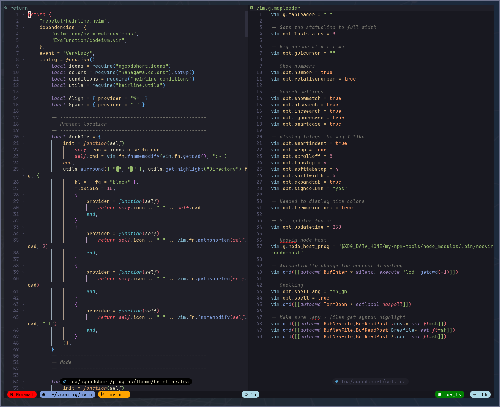

# Neovim Config

[](https://dotfyle.com/abiencourt/nvim)
[](https://dotfyle.com/abiencourt/nvim)

[](https://github.com/abiencourt/nvim/commits/master)
[](https://wakapi.dev/)



## Installation

> Install requires Neovim 0.9+.

Clone the repository and install the plugins:

```sh
git clone git@github.com:abiencourt/nvim ~/.config/abiencourt/nvim
NVIM_APPNAME=abiencourt/nvim/ nvim --headless +"Lazy! restore" +qa
```

Open Neovim with this config:

```sh
NVIM_APPNAME=abiencourt/nvim/ nvim
```

## Tips

### LSPs, formatters and linters

Documentation on the configuration of LSPs, formatters and linters is available in this [README.md](lua/abiencourt/plugins/lsp-formatter-linter/README.md)

### Search and replace

The below applies when replacing using `:%s`.

- You can use `<C-r><C-w>` to get the word under the cursor into to command line.
- When a word was already searched (e.g. `\word`), use `:%s//` to replace the word searched.

### Useful keymaps

- `<C+]>` is used to follow tags in `:help`

### nvm

As [nvm](https://github.com/nvm-sh/nvm) is used to switch versions of Node.js, some plugins might require to rebuild when changing `nvm` default version:

- markmap.nvim
- import-cost.nvim

## To Do

- [ ] Review how to use `K` when on neovim man page
- [ ] Neovim `initial_mode = "normal"` does not work for extensions git_diffs
- [ ] test [NeoAI](https://github.com/Bryley/neoai.nvim)
- [ ] [Show appropriate documentation](https://github.com/Saecki/crates.nvim/wiki/Documentation-v0.4.0#show-appropriate-documentation-in-cargotoml) in `cargo.toml`
- [ ] Telescope live grep to wrap lines. Check if plugin can do this, otherwise see [telescope.nvim documentation](https://github.com/nvim-telescope/telescope.nvim#previewers)
- [ ] Use the syntax `function() require("dap").continue() end` for whichkey and upgrade to `v3`
- [ ] Based on the [nvm](#nvm) above, could we rebuild automatically if the npm package is not found?
- [ ] Add keymap to toggle image preview
- [ ] lspsaga does float terminal : <https://nvimdev.github.io/lspsaga/floaterm/>
- [ ] lspsaga hover cannot open links
- [ ] Should we keep using noice if we use snacks notifier
- [ ] Finish using snacks toggle
